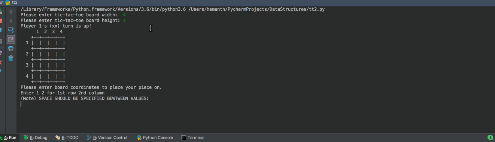
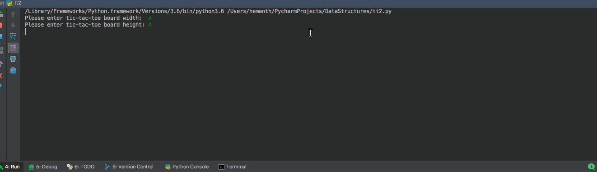

# TicTacToe
Tic-Tac-Toe is a very simple two player game. So only two players can play at a time. This game is also known as Noughts and Crosses or Xs and Os game. One player plays with X and the other player plays with O.

In this game the user will input the size of the board(length & width). After which the player will get their alternative turns.

Each player has to input the coordinates of the board

**Game Rules**

1. Traditionally the first player plays with "X". So you can decide who wants to go with "X" and who wants go with "O".

2. Only one player can play at a time.

3. If any of the players have filled a square then the other player and the same player cannot override that square.

4. There are only two conditions that may match, there will be draw or win.

5. The player that succeeds in placing respective marks (xx or oo) in a horizontal, vertical or diagonal row wins the game.

**Winning condition**

Whoever places three respective marks (xx or oo) horizontally, vertically or diagonally will be the winner.

The gifs below show the 4 by 4 board for a win & tie game.

**How to run the code**
1. Using any python IDE
2. Using the command line python interpreter by using the following command
    * python TicTacToe.py

**Winning Game GIF**

**Tie Game GIF**

